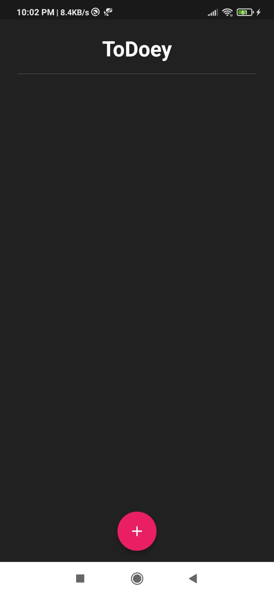
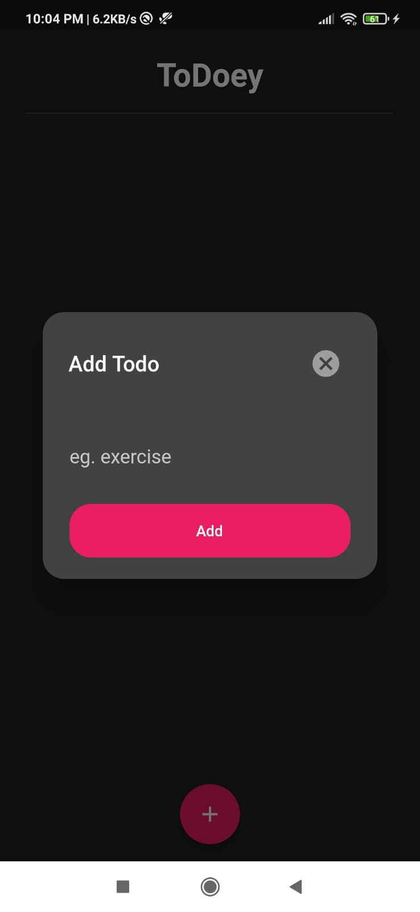
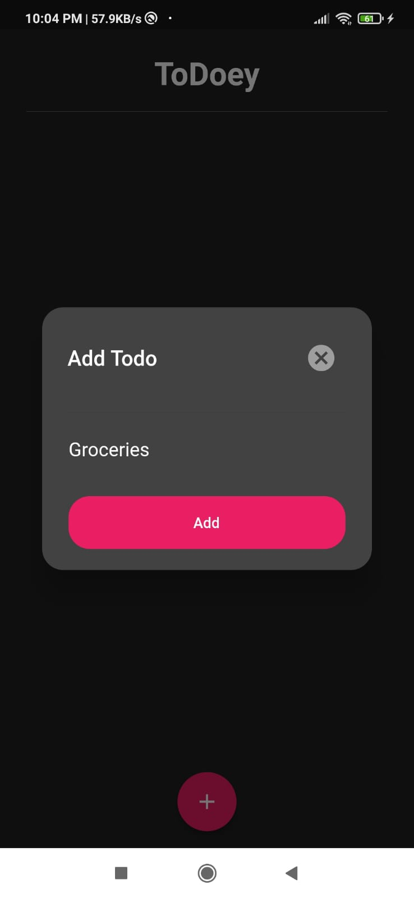
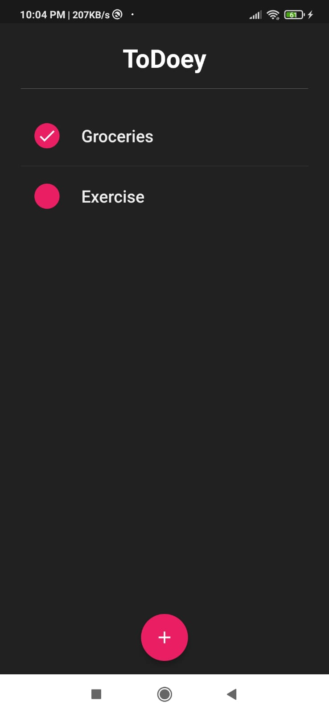
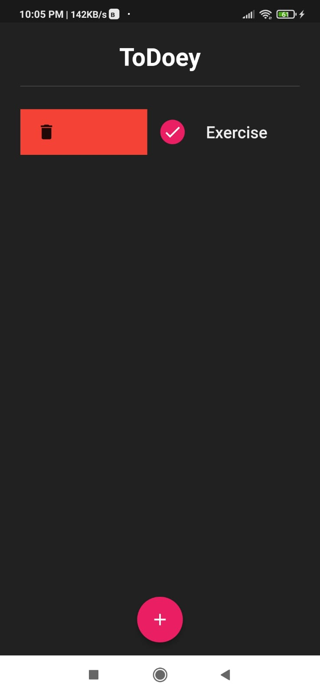

<h1 align="center">ToDoey</h1>
<!-- Add banner here -->

  

  Make your life easy, with ToDoey!

<b>Solved Problem:</b> We all have those days when there are a million things to do, and we don't know how we're going to get it all done. It's easy to become overwhelmed by the vast quantity of tasks that we must do from day to day. Hence, organizing the tasks with a list can make everything manageable and gives a clear outline of the tasks that you've got to do and those you've completed, it helps you stay focused.

## Table of contents

- [Features of the Application](#features-of-the-application)
- [Tech Stack Selection](#tech-stack-selection)
- [How To Use](#how-to-use)
- [Challenges Faced](#challenges-faced)
- [Learnings](#learnings)

## Features of the Application

1. Creation of To-do task
2. Mark the task as completed
3. Delete the tasks

## Tech Stack Selection 

For frontend development, I have used <b>Flutter</b>, which helps to create cross-platform applications. For backend development, I have used <b>Firebase</b>.

[(Back to top)](#table-of-contents)

## How To Use

1. ToDoey application is used to maintain the to-do list of the user so that one can easily prioritize their tasks.

 

 

2. Clicking on the icon open the applications’ home page.

 

 

3. Pressing the ‘+’ icon present at the bottom of the screen opens the task entry dialog box.

 

 

4. After entering the task in the dialog box and pressing on ‘Add’ button, the tasks is added on the home page.

    

 

5. The application gives an option to the user to delete the tasks. User can delete the tasks by either right or left swiping the task.

 

[(Back to top)](#table-of-contents)

## Challenges Faced

 During the development process I faced the following challenges: 

1. Connection establishment with Backend

Initially, the connection with the firebase, which is serving as the database of the application, was easily made. However, after slight changes the connection was getting failed again and again. After, a deep analysis I found that the entries made in the database were not compatible with the ones which were in the original project, Hence, the error was rectified and the connection was established successfully.

2. Tasks editing

Editing the tasks in the tiles was very difficult as fetching the data which once entered by the user and make it editable took a lot of research and efforts.

3. Saving previous states

After closing the application, last entered tasks were getting erased. Due to the error in the state management and connection establishment this was happening. Correcting the mistake, application was successfully able to complete the task for which it was created that is, to save the to-do list for the user.

[(Back to top)](#table-of-contents)

## Learnings

1. I learnt many state management techniques and came to know how to implement CRUD state management strategy.
2. Integrating Firebase with Flutter gave me in-depth knowledge about the databases and backend technologies.
3. MVC Architecture implemented in this application gave me insights about the fabrication, laying, designing and development of the large-scale applications.

[(Back to top)](#table-of-contents)
